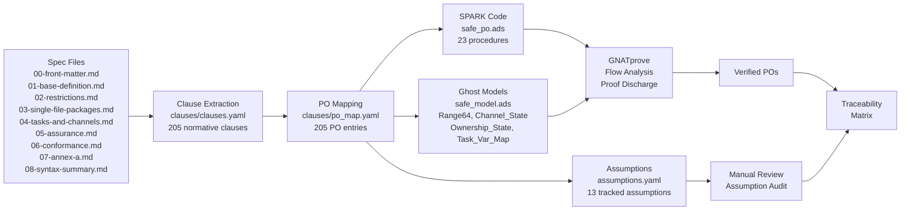
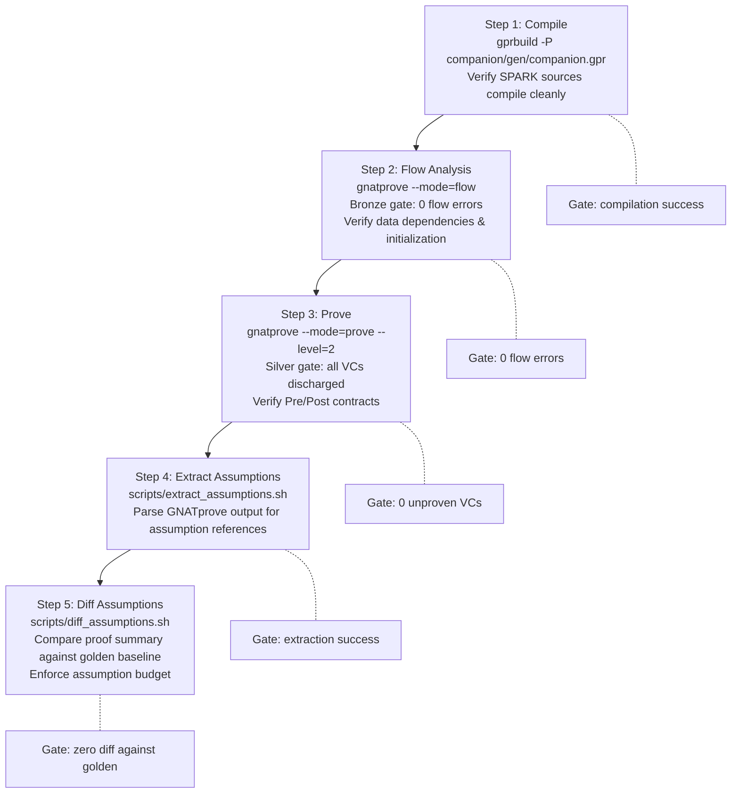

# Safe Language Annotated SPARK Companion -- Traceability Matrix

**Frozen commit SHA:** `468cf72`
**Generated:** 2026-03-05
**Total normative clauses:** 205
**Spec files parsed:** 10

---

## Table of Contents

1. [Clause-to-Artifact Mapping](#1-clause-to-artifact-mapping)
2. [PO Category Summary](#2-po-category-summary)
3. [D27 Rule Coverage](#3-d27-rule-coverage)
4. [Assumption Cross-Reference](#4-assumption-cross-reference)
5. [Test Coverage Summary](#5-test-coverage-summary)
6. [Clause Flow Diagram](#6-clause-flow-diagram)
7. [Verification Pipeline Diagram](#7-verification-pipeline-diagram)

---

## 1. Clause-to-Artifact Mapping

Every clause in `clauses/clauses.yaml` is listed below with its corresponding
generated artifact, test file(s), and implementation status.

### spec/00-front-matter.md

| # | Clause ID | Section | Para | Target | Artifact | Test File(s) | Status |
|---|-----------|---------|------|--------|----------|-------------|--------|
| 1 | `0.1.p1:40d0d4cf` | 0.1 | 1 | Conformance | N/A | -- | stubbed |
| 2 | `0.1.p2:9e5cd9ab` | 0.1 | 2 | Conformance | N/A | -- | stubbed |
| 3 | `0.5.p21:5eb1de72` | 0.5 | 21 | Conformance | N/A | -- | stubbed |
| 4 | `0.8.p27:5000a79a` | 0.8 | 27 | Conformance | N/A | -- | deferred |

### spec/01-base-definition.md

| # | Clause ID | Section | Para | Target | Artifact | Test File(s) | Status |
|---|-----------|---------|------|--------|----------|-------------|--------|
| 1 | `1.p1:e7bf1014` | 1 | 1 | Conformance | N/A | -- | stubbed |
| 2 | `1.p2:b610468e` | 1 | 2 | Conformance | N/A | -- | stubbed |
| 3 | `1.p3:a2ff4ad4` | 1 | 3 | Conformance | N/A | -- | stubbed |
| 4 | `1.p6:b83ece40` | 1 | 6 | Conformance | N/A | -- | stubbed |

### spec/02-restrictions.md

| # | Clause ID | Section | Para | Target | Artifact | Test File(s) | Status |
|---|-----------|---------|------|--------|----------|-------------|--------|
| 1 | `2.1.1.p2:75c5cfea` | 2.1.1 | 2 | Conformance | N/A | -- | stubbed |
| 2 | `2.1.1.p3:f8550668` | 2.1.1 | 3 | Conformance | N/A | -- | stubbed |
| 3 | `2.1.1.p4:b8e73758` | 2.1.1 | 4 | Conformance | N/A | -- | stubbed |
| 4 | `2.1.2.p5:c8832ac8` | 2.1.2 | 5 | Conformance | N/A | -- | stubbed |
| 5 | `2.1.2.p7:2de62408` | 2.1.2 | 7 | Conformance | N/A | -- | stubbed |
| 6 | `2.1.2.p9:faae18b9` | 2.1.2 | 9 | Conformance | N/A | -- | stubbed |
| 7 | `2.1.2.p11:3fd55933` | 2.1.2 | 11 | Conformance | N/A | -- | stubbed |
| 8 | `2.1.2.p12:8da68138` | 2.1.2 | 12 | Conformance | N/A | -- | stubbed |
| 9 | `2.1.3.p14:4ab42f23` | 2.1.3 | 14 | Conformance | N/A | -- | stubbed |
| 10 | `2.1.3.p15:9092af85` | 2.1.3 | 15 | Conformance | N/A | -- | stubbed |
| 11 | `2.1.3.p16:6436f829` | 2.1.3 | 16 | Conformance | N/A | -- | stubbed |
| 12 | `2.1.3.p17:be123e5f` | 2.1.3 | 17 | Conformance | N/A | -- | stubbed |
| 13 | `2.1.3.p19:29c43768` | 2.1.3 | 19 | Conformance | N/A | -- | stubbed |
| 14 | `2.1.3.p22:58a7c04c` | 2.1.3 | 22 | Conformance | N/A | -- | stubbed |
| 15 | `2.1.3.p23:e51d510c` | 2.1.3 | 23 | Conformance | N/A | -- | stubbed |
| 16 | `2.1.3.p25:f55ddbee` | 2.1.3 | 25 | Conformance | N/A | -- | stubbed |
| 17 | `2.1.4.p29:f27b01a7` | 2.1.4 | 29 | Conformance | N/A | -- | stubbed |
| 18 | `2.1.4.p31:3aff42cb` | 2.1.4 | 31 | Conformance | N/A | -- | stubbed |
| 19 | `2.1.4.p32:d090f2f1` | 2.1.4 | 32 | Conformance | N/A | -- | stubbed |
| 20 | `2.1.5.p34:70346a23` | 2.1.5 | 34 | Conformance | N/A | -- | stubbed |
| 21 | `2.1.5.p35:9db565e8` | 2.1.5 | 35 | Conformance | N/A | -- | stubbed |
| 22 | `2.1.5.p36:ba7835b4` | 2.1.5 | 36 | Conformance | N/A | -- | stubbed |
| 23 | `2.1.5.p38:872f4ec6` | 2.1.5 | 38 | Conformance | N/A | -- | stubbed |
| 24 | `2.1.5.p40:cc41753d` | 2.1.5 | 40 | Conformance | N/A | -- | stubbed |
| 25 | `2.1.6.p44:a5524a86` | 2.1.6 | 44 | Conformance | N/A | -- | stubbed |
| 26 | `2.1.7.p51:3bd0226a` | 2.1.7 | 51 | Conformance | N/A | -- | stubbed |
| 27 | `2.1.8.p57:6fc7a14c` | 2.1.8 | 57 | Race-freedom | N/A | -- | stubbed |
| 28 | `2.1.8.p58:9bf4999c` | 2.1.8 | 58 | Conformance | N/A | -- | stubbed |
| 29 | `2.1.8.p59:95c073d3` | 2.1.8 | 59 | Conformance | N/A | -- | stubbed |
| 30 | `2.1.8.p60:75dc85e6` | 2.1.8 | 60 | Conformance | N/A | -- | stubbed |
| 31 | `2.1.8.p61:f91fb172` | 2.1.8 | 61 | Conformance | N/A | -- | stubbed |
| 32 | `2.1.8.p62:9053b623` | 2.1.8 | 62 | Conformance | N/A | -- | stubbed |
| 33 | `2.1.9.p65:a6f8ab1c` | 2.1.9 | 65 | Conformance | N/A | -- | stubbed |
| 34 | `2.1.9.p66:3d98f9e9` | 2.1.9 | 66 | Conformance | N/A | -- | stubbed |
| 35 | `2.1.10.p67:50d815f0` | 2.1.10 | 67 | Conformance | N/A | -- | stubbed |
| 36 | `2.1.11.p69:4ced1c77` | 2.1.11 | 69 | Conformance | N/A | -- | stubbed |
| 37 | `2.1.12.p77:8b158e82` | 2.1.12 | 77 | Conformance | N/A | -- | stubbed |
| 38 | `2.1.12.p78:803e4add` | 2.1.12 | 78 | Conformance | N/A | -- | stubbed |
| 39 | `2.1.12.p79:90727967` | 2.1.12 | 79 | Memory-safety | N/A | -- | stubbed |
| 40 | `2.1.12.p80:15d3c6f7` | 2.1.12 | 80 | Memory-safety | N/A | -- | stubbed |
| 41 | `2.1.12.p82:453192f0` | 2.1.12 | 82 | Conformance | N/A | -- | stubbed |
| 42 | `2.1.13.p84:84829058` | 2.1.13 | 84 | Conformance | N/A | -- | stubbed |
| 43 | `2.1.13.p91:4a433f78` | 2.1.13 | 91 | Conformance | N/A | -- | stubbed |
| 44 | `2.2.p93:301d16b8` | 2.2 | 93 | Conformance | N/A | -- | stubbed |
| 45 | `2.7.p124:ef993f07` | 2.7 | 124 | Conformance | N/A | -- | stubbed |
| 46 | `2.3.2.p96a:0eaf48aa` | 2.3.2 | 96a | Memory-safety | Safe_PO.Check_Owned_For_Move, Safe_Model.Ownership_State, Safe_Model.Make_Channel, Safe_Model.Is_Borrowable, Safe_Model.Is_Movable | ownership_move.safe, rule4_linked_list.safe, neg_own_double_move.safe, golden_ownership/, diag_double_move.txt | stubbed |
| 47 | `2.3.2.p96c:0b45de01` | 2.3.2 | 96c | Memory-safety | Safe_PO.Check_Not_Moved, Safe_Model.Ownership_State, Safe_Model.Make_Channel | ownership_move.safe, neg_own_double_move.safe, neg_own_use_after_move.safe, neg_rule4_moved.safe, golden_ownership/, diag_double_move.txt | stubbed |
| 48 | `2.3.2.p97a:8d0214d5` | 2.3.2 | 97a | Memory-safety | N/A | ownership_move.safe, golden_ownership/ | stubbed |
| 49 | `2.3.2.p97a-diag:dc259149` | 2.3.2 | 97a-diag | Memory-safety | N/A | -- | stubbed |
| 50 | `2.3.3.p99b:47108b45` | 2.3.3 | 99b | Memory-safety | Safe_PO.Check_Borrow_Exclusive, Safe_Model.Ownership_State, Safe_Model.Make_Channel, Safe_Model.Is_Observable, Safe_Model.Is_Borrowable | ownership_borrow.safe, neg_own_borrow_conflict.safe | stubbed |
| 51 | `2.3.3.p100a:ba849e66` | 2.3.3 | 100a | Memory-safety | N/A | ownership_borrow.safe | stubbed |
| 52 | `2.3.4a.p102a:5bc5ab8b` | 2.3.4a | 102a | Memory-safety | Safe_PO.Check_Observe_Shared, Safe_Model.Ownership_State, Safe_Model.Make_Channel, Safe_Model.Is_Valid_Transition, Safe_Model.Is_Observable | ownership_observe.safe, neg_own_lifetime.safe, neg_own_observe_mutate.safe | stubbed |
| 53 | `2.3.4a.p102a-a:ae729065` | 2.3.4a | 102a-a | Memory-safety | N/A | ownership_observe.safe, neg_own_lifetime.safe | stubbed |
| 54 | `2.3.4a.p102b:2ed757bd` | 2.3.4a | 102b | Memory-safety | Safe_Model.Ownership_State, Safe_Model.Make_Channel | neg_rule4_freed.safe | stubbed |
| 55 | `2.3.4a.p102b-diag:ddab22c8` | 2.3.4a | 102b-diag | Memory-safety | N/A | neg_rule4_freed.safe | stubbed |
| 56 | `2.3.5.p103a:520dc0d4` | 2.3.5 | 103a | Memory-safety | N/A | rule4_factory.safe | stubbed |
| 57 | `2.3.5.p104:d9f9b8d9` | 2.3.5 | 104 | Memory-safety | N/A | golden_ownership/ | stubbed |
| 58 | `2.3.5.p104a:b70c1d15` | 2.3.5 | 104a | Memory-safety | N/A | -- | stubbed |
| 59 | `2.3.5.p105:d4a9cdb4` | 2.3.5 | 105 | Memory-safety | N/A | -- | stubbed |
| 60 | `2.3.5.p106:bae12394` | 2.3.5 | 106 | Memory-safety | N/A | -- | stubbed |
| 61 | `2.3.7.p108:083e15a2` | 2.3.7 | 108 | Memory-safety | N/A | -- | stubbed |
| 62 | `2.3.8.p111:42819528` | 2.3.8 | 111 | Memory-safety | N/A | -- | stubbed |
| 63 | `2.3.8.p111a:a858bdfc` | 2.3.8 | 111a | Memory-safety | N/A | -- | stubbed |
| 64 | `2.3.8.p111b:2921e9d2` | 2.3.8 | 111b | Memory-safety | N/A | -- | stubbed |
| 65 | `2.3.8.p111c:819cc398` | 2.3.8 | 111c | Memory-safety | N/A | -- | stubbed |
| 66 | `2.3.8.p113:75fcd707` | 2.3.8 | 113 | Silver-AoRTE | N/A | -- | stubbed |
| 67 | `2.3.8.p109-end:5d18703e` | 2.3.8 | 109-end | Silver-AoRTE | N/A | -- | stubbed |
| 68 | `2.8.1.p126:812b54a8` | 2.8.1 | 126 | Silver-AoRTE | Safe_PO.Safe_Div, Safe_Model.Range64 | rule1_accumulate.safe, rule1_averaging.safe, rule2_binary_search.safe, rule3_average.safe, neg_rule1_overflow.safe, golden_sensors/, diag_overflow.txt | stubbed |
| 69 | `2.8.1.p127:d5d93439` | 2.8.1 | 127 | Silver-AoRTE | Safe_PO.Narrow_Assignment, Safe_PO.Narrow_Parameter, Safe_PO.Narrow_Return, Safe_PO.Narrow_Indexing, Safe_PO.Narrow_Conversion, Safe_Model.Range64 | rule1_accumulate.safe, rule1_averaging.safe, rule1_conversion.safe, rule1_parameter.safe, rule1_return.safe, rule3_percent.safe, neg_rule1_index_fail.safe, neg_rule1_narrow_fail.safe, neg_rule1_param_fail.safe, neg_rule1_return_fail.safe, golden_sensors/ | stubbed |
| 70 | `2.8.1.p128:d2e83ca8` | 2.8.1 | 128 | Silver-AoRTE | Safe_Model.Range64, Safe_Model.Excludes_Zero | -- | stubbed |
| 71 | `2.8.1.p129:9f3b1394` | 2.8.1 | 129 | Silver-AoRTE | N/A | rule1_accumulate.safe, neg_rule1_overflow.safe, diag_overflow.txt | stubbed |
| 72 | `2.8.1.p130:2289e5b2` | 2.8.1 | 130 | Silver-AoRTE | Safe_PO.Narrow_Assignment, Safe_PO.Narrow_Parameter, Safe_PO.Narrow_Conversion | rule1_conversion.safe, rule1_parameter.safe, neg_rule1_narrow_fail.safe, neg_rule1_param_fail.safe | stubbed |
| 73 | `2.8.2.p131:30aba5f5` | 2.8.2 | 131 | Silver-AoRTE | Safe_PO.Narrow_Indexing, Safe_PO.Safe_Index | rule2_binary_search.safe, rule2_iteration.safe, rule2_lookup.safe, rule2_matrix.safe, rule2_slice.safe, neg_rule1_index_fail.safe, neg_rule2_dynamic.safe, neg_rule2_empty.safe, neg_rule2_negative.safe, neg_rule2_off_by_one.safe, neg_rule2_oob.safe, diag_index_oob.txt | stubbed |
| 74 | `2.8.2.p132:8613ecf4` | 2.8.2 | 132 | Silver-AoRTE | Safe_PO.Safe_Index | rule2_lookup.safe, rule2_matrix.safe, rule2_slice.safe, neg_rule2_dynamic.safe, neg_rule2_empty.safe, neg_rule2_negative.safe, neg_rule2_off_by_one.safe, neg_rule2_oob.safe, diag_index_oob.txt | stubbed |
| 75 | `2.8.3.p133:0610d951` | 2.8.3 | 133 | Silver-AoRTE | Safe_PO.Safe_Div, Safe_PO.Nonzero, Safe_PO.Safe_Mod, Safe_PO.Safe_Rem, Safe_Model.Excludes_Zero | rule3_average.safe, rule3_divide.safe, rule3_modulo.safe, rule3_percent.safe, rule3_remainder.safe, rule5_statistics.safe, neg_rule3_expression.safe, neg_rule3_variable.safe, neg_rule3_zero_div.safe, neg_rule3_zero_mod.safe, neg_rule3_zero_rem.safe, diag_zero_div.txt | stubbed |
| 76 | `2.8.3.p134:90a17a3b` | 2.8.3 | 134 | Silver-AoRTE | Safe_PO.Nonzero | rule3_divide.safe, rule3_modulo.safe, rule3_remainder.safe, neg_rule3_expression.safe, neg_rule3_variable.safe, neg_rule3_zero_div.safe, neg_rule3_zero_mod.safe, neg_rule3_zero_rem.safe, diag_zero_div.txt | stubbed |
| 77 | `2.8.4.p136:fa5e94b7` | 2.8.4 | 136 | Silver-AoRTE | Safe_PO.Not_Null_Ptr, Safe_PO.Safe_Deref, Safe_Model.Is_Dereferenceable, Safe_Model.Is_Accessible | rule4_conditional.safe, rule4_deref.safe, rule4_factory.safe, rule4_linked_list.safe, rule4_optional.safe, neg_rule4_maybe_null.safe, neg_rule4_moved.safe, neg_rule4_null_deref.safe, neg_rule4_uninitialized.safe, diag_null_deref.txt | stubbed |
| 78 | `2.8.5.p139:d50bc714` | 2.8.5 | 139 | Silver-AoRTE | Safe_PO.FP_Safe_Div | rule5_normalize.safe, neg_rule5_div_zero.safe | stubbed |
| 79 | `2.8.5.p139b:5e20032b` | 2.8.5 | 139b | Silver-AoRTE | Safe_PO.FP_Not_Infinity, Safe_PO.FP_Safe_Div | rule5_filter.safe, rule5_interpolate.safe, rule5_normalize.safe, rule5_statistics.safe, rule5_temperature.safe, neg_rule5_infinity.safe, neg_rule5_overflow.safe | stubbed |
| 80 | `2.8.5.p139c:7fad4f7d` | 2.8.5 | 139c | Silver-AoRTE | N/A | neg_rule5_nan.safe, neg_rule5_overflow.safe, neg_rule5_uninitialized.safe | stubbed |
| 81 | `2.8.5.p139d:56f1f36b` | 2.8.5 | 139d | Silver-AoRTE | Safe_PO.FP_Not_NaN, Safe_PO.FP_Not_Infinity | rule5_filter.safe, rule5_interpolate.safe, rule5_normalize.safe, rule5_statistics.safe, rule5_temperature.safe, neg_rule5_div_zero.safe, neg_rule5_infinity.safe, neg_rule5_nan.safe, neg_rule5_uninitialized.safe | stubbed |
| 82 | `2.9.p140:7eeb1bb6` | 2.9 | 140 | Conformance | N/A | -- | stubbed |
| 83 | `2.10.p141:9e5dc3fe` | 2.10 | 141 | Conformance | N/A | -- | stubbed |

### spec/03-single-file-packages.md

| # | Clause ID | Section | Para | Target | Artifact | Test File(s) | Status |
|---|-----------|---------|------|--------|----------|-------------|--------|
| 1 | `3.p0:dcd1bc13` | 3 | 0 | Conformance | N/A | -- | stubbed |
| 2 | `3.2.1.p8:cb47c342` | 3.2.1 | 8 | Conformance | N/A | -- | stubbed |
| 3 | `3.2.2.p9:d7d76101` | 3.2.2 | 9 | Conformance | N/A | -- | stubbed |
| 4 | `3.2.3.p12:b76eb7bf` | 3.2.3 | 12 | Conformance | N/A | -- | stubbed |
| 5 | `3.2.3.p13:8bf74e20` | 3.2.3 | 13 | Conformance | N/A | -- | stubbed |
| 6 | `3.2.3.p14:c205a40a` | 3.2.3 | 14 | Conformance | N/A | -- | stubbed |
| 7 | `3.2.4.p15:e090edc2` | 3.2.4 | 15 | Conformance | N/A | -- | stubbed |
| 8 | `3.2.5.p19:05cb629b` | 3.2.5 | 19 | Conformance | N/A | -- | stubbed |
| 9 | `3.2.5.p20:d2c1d841` | 3.2.5 | 20 | Conformance | N/A | -- | stubbed |
| 10 | `3.2.6.p23:26dc2217` | 3.2.6 | 23 | Conformance | N/A | -- | stubbed |
| 11 | `3.2.6.p24:12e57227` | 3.2.6 | 24 | Conformance | N/A | -- | stubbed |
| 12 | `3.2.9.p31:c2a3dc04` | 3.2.9 | 31 | Conformance | N/A | -- | stubbed |
| 13 | `3.2.10.p32:be83c6b5` | 3.2.10 | 32 | Conformance | N/A | -- | stubbed |
| 14 | `3.3.1.p33:b08ead48` | 3.3.1 | 33 | Conformance | N/A | -- | stubbed |
| 15 | `3.3.1.p34:2a0b2728` | 3.3.1 | 34 | Conformance | N/A | -- | stubbed |
| 16 | `3.3.1.p35:0bbb4bb7` | 3.3.1 | 35 | Conformance | N/A | -- | stubbed |
| 17 | `3.3.4.p40:cdfbcb6b` | 3.3.4 | 40 | Conformance | N/A | -- | stubbed |
| 18 | `3.4.1.p42:b88e8ad4` | 3.4.1 | 42 | Determinism | N/A | -- | stubbed |
| 19 | `3.4.2.p44:a655dde4` | 3.4.2 | 44 | Determinism | N/A | -- | stubbed |
| 20 | `3.4.2.p45:80712e1a` | 3.4.2 | 45 | Determinism | N/A | -- | stubbed |
| 21 | `3.4.3.p46:b5f92bd9` | 3.4.3 | 46 | Race-freedom | N/A | -- | stubbed |
| 22 | `3.5.1.p47:b7e93197` | 3.5.1 | 47 | Conformance | N/A | -- | stubbed |
| 23 | `3.5.1.p48:616dd05d` | 3.5.1 | 48 | Conformance | N/A | -- | stubbed |
| 24 | `3.5.2.p49:02b25de0` | 3.5.2 | 49 | Conformance | N/A | -- | stubbed |

### spec/04-tasks-and-channels.md

| # | Clause ID | Section | Para | Target | Artifact | Test File(s) | Status |
|---|-----------|---------|------|--------|----------|-------------|--------|
| 1 | `4.1.p2:78f022f7` | 4.1 | 2 | Race-freedom | N/A | channel_pingpong.safe, channel_pipeline.safe, golden_pipeline/ | stubbed |
| 2 | `4.1.p3:542e0dee` | 4.1 | 3 | Race-freedom | N/A | -- | stubbed |
| 3 | `4.1.p4:016e5737` | 4.1 | 4 | Conformance | N/A | -- | stubbed |
| 4 | `4.1.p5:4e4afebc` | 4.1 | 5 | Race-freedom | N/A | -- | stubbed |
| 5 | `4.1.p6:be85291b` | 4.1 | 6 | Conformance | N/A | -- | stubbed |
| 6 | `4.1.p7:393c53c2` | 4.1 | 7 | Conformance | N/A | -- | stubbed |
| 7 | `4.1.p9:b4640bda` | 4.1 | 9 | Conformance | N/A | -- | stubbed |
| 8 | `4.1.p10:92a67777` | 4.1 | 10 | Race-freedom | N/A | -- | stubbed |
| 9 | `4.1.p11:2460c5cb` | 4.1 | 11 | Determinism | N/A | -- | stubbed |
| 10 | `4.2.p13:4f888b03` | 4.2 | 13 | Conformance | N/A | -- | stubbed |
| 11 | `4.2.p14:a35bd0fa` | 4.2 | 14 | Conformance | N/A | -- | stubbed |
| 12 | `4.2.p15:b5b29b0e` | 4.2 | 15 | Conformance | Safe_PO.Check_Channel_Capacity_Positive, Safe_Model.Channel_State | channel_pingpong.safe, channel_pipeline.safe, neg_chan_empty_recv.safe, neg_chan_full_send.safe, neg_chan_zero_cap.safe, golden_pipeline/ | stubbed |
| 13 | `4.2.p20:8aa1a21e` | 4.2 | 20 | Determinism | Safe_Model.Channel_State | channel_pingpong.safe, channel_pipeline.safe, golden_pipeline/, fifo_ordering.safe | stubbed |
| 14 | `4.2.p21:c6a92460` | 4.2 | 21 | Race-freedom | N/A | -- | stubbed |
| 15 | `4.2.p21a:16ec46cb` | 4.2 | 21a | Race-freedom | N/A | -- | stubbed |
| 16 | `4.3.p23:197d9a49` | 4.3 | 23 | Conformance | N/A | -- | stubbed |
| 17 | `4.3.p24:9e47ed4c` | 4.3 | 24 | Conformance | N/A | -- | stubbed |
| 18 | `4.3.p25:961abe5a` | 4.3 | 25 | Conformance | N/A | -- | stubbed |
| 19 | `4.3.p26:3a9449c1` | 4.3 | 26 | Conformance | N/A | -- | stubbed |
| 20 | `4.3.p27:ef0ce6bd` | 4.3 | 27 | Race-freedom | Safe_PO.Check_Channel_Not_Full, Safe_Model.Channel_State | channel_pingpong.safe, channel_pipeline.safe, neg_chan_full_send.safe, golden_pipeline/, fifo_ordering.safe, multi_task_channel.safe | stubbed |
| 21 | `4.3.p27a:8ed3c1d4` | 4.3 | 27a | Memory-safety | N/A | channel_access_type.safe, neg_channel_access_component.safe | stubbed |
| 22 | `4.3.p28:ea6bd13c` | 4.3 | 28 | Race-freedom | Safe_PO.Check_Channel_Not_Empty, Safe_Model.Channel_State | channel_pingpong.safe, channel_pipeline.safe, neg_chan_empty_recv.safe, golden_pipeline/, fifo_ordering.safe, multi_task_channel.safe | stubbed |
| 23 | `4.3.p28a:4cb19779` | 4.3 | 28a | Memory-safety | N/A | channel_access_type.safe, select_ownership_binding.safe | stubbed |
| 24 | `4.3.p29:f792d704` | 4.3 | 29 | Race-freedom | Safe_PO.Check_Channel_Not_Full | try_ops.safe | stubbed |
| 25 | `4.3.p29a:8d3f2225` | 4.3 | 29a | Memory-safety | N/A | try_ops.safe, try_send_ownership.safe | stubbed |
| 26 | `4.3.p29b:7121ccd7` | 4.3 | 29b | Memory-safety | N/A | try_ops.safe, try_send_ownership.safe | stubbed |
| 27 | `4.3.p30:62619161` | 4.3 | 30 | Memory-safety | N/A | try_ops.safe | stubbed |
| 28 | `4.3.p31:a7297e97` | 4.3 | 31 | Race-freedom | Safe_Model.Channel_State | channel_pipeline.safe, golden_pipeline/, multi_task_channel.safe | stubbed |
| 29 | `4.3.p31a:a621d08c` | 4.3 | 31a | Memory-safety | N/A | channel_access_type.safe, neg_channel_access_component.safe | stubbed |
| 30 | `4.4.p33:7a94ab51` | 4.4 | 33 | Conformance | N/A | select_priority.safe, select_with_delay.safe, select_delay_local_scope.safe | stubbed |
| 31 | `4.4.p34:f0f83b83` | 4.4 | 34 | Conformance | N/A | -- | stubbed |
| 32 | `4.4.p35:2ad6e64f` | 4.4 | 35 | Conformance | N/A | select_priority.safe | stubbed |
| 33 | `4.4.p36:0bffbd47` | 4.4 | 36 | Conformance | N/A | -- | stubbed |
| 34 | `4.4.p37:6ced8129` | 4.4 | 37 | Conformance | N/A | -- | stubbed |
| 35 | `4.4.p38:35ed84d9` | 4.4 | 38 | Conformance | N/A | select_with_delay.safe, select_delay_local_scope.safe | stubbed |
| 36 | `4.4.p39:1012f4db` | 4.4 | 39 | Determinism | N/A | select_priority.safe | stubbed |
| 37 | `4.4.p40:4cfdeffe` | 4.4 | 40 | Determinism | N/A | -- | stubbed |
| 38 | `4.4.p41:cdf6a558` | 4.4 | 41 | Determinism | N/A | -- | stubbed |
| 39 | `4.4.p42:dce8ac38` | 4.4 | 42 | Race-freedom | N/A | -- | stubbed |
| 40 | `4.5.p45:8bdd0c99` | 4.5 | 45 | Race-freedom | Safe_PO.Check_Exclusive_Ownership, Safe_Model.Var_Id_Range | exclusive_variable.safe | stubbed |
| 41 | `4.5.p47:bc08fb3b` | 4.5 | 47 | Race-freedom | N/A | -- | stubbed |
| 42 | `4.5.p49:d2001725` | 4.5 | 49 | Race-freedom | N/A | -- | stubbed |
| 43 | `4.5.p50:2882310a` | 4.5 | 50 | Conformance | N/A | -- | stubbed |
| 44 | `4.6.p53:897d5577` | 4.6 | 53 | Race-freedom | N/A | -- | stubbed |
| 45 | `4.6.p53b:19b7c4ae` | 4.6 | 53b | Conformance | N/A | -- | stubbed |
| 46 | `4.6.p53c:77a5f52c` | 4.6 | 53c | Conformance | N/A | -- | stubbed |
| 47 | `4.7.p56:55e4230e` | 4.7 | 56 | Race-freedom | N/A | -- | stubbed |
| 48 | `4.7.p58:d10f9cd1` | 4.7 | 58 | Determinism | N/A | -- | stubbed |

### spec/05-assurance.md

| # | Clause ID | Section | Para | Target | Artifact | Test File(s) | Status |
|---|-----------|---------|------|--------|----------|-------------|--------|
| 1 | `5.1.p2:14a5a600` | 5.1 | 2 | Conformance | N/A | -- | stubbed |
| 2 | `5.2.1.p3:ce5a8fe7` | 5.2.1 | 3 | Bronze-flow | N/A | -- | stubbed |
| 3 | `5.2.2.p5:a07e15ef` | 5.2.2 | 5 | Bronze-flow | N/A | -- | stubbed |
| 4 | `5.2.3.p8:dfb93f2c` | 5.2.3 | 8 | Bronze-flow | N/A | -- | stubbed |
| 5 | `5.2.4.p11:b89bd341` | 5.2.4 | 11 | Bronze-flow | N/A | -- | stubbed |
| 6 | `5.3.1.p12:99a94209` | 5.3.1 | 12 | Silver-AoRTE | Safe_PO.Safe_Div, Safe_PO.Safe_Index, Safe_PO.Not_Null_Ptr | -- | stubbed |
| 7 | `5.3.1.p12a:047a8410` | 5.3.1 | 12a | Silver-AoRTE | N/A | -- | stubbed |
| 8 | `5.3.2.p15:1ab3314c` | 5.3.2 | 15 | Silver-AoRTE | Safe_Model.Range64 | -- | stubbed |
| 9 | `5.3.2.p16:2e323902` | 5.3.2 | 16 | Silver-AoRTE | N/A | -- | stubbed |
| 10 | `5.3.6.p25:e8253bd7` | 5.3.6 | 25 | Silver-AoRTE | Safe_PO.Narrow_Assignment, Safe_PO.Narrow_Return | rule1_averaging.safe, rule1_return.safe, neg_rule1_return_fail.safe, golden_sensors/ | stubbed |
| 11 | `5.3.6.p26:9ca2c786` | 5.3.6 | 26 | Silver-AoRTE | N/A | neg_rule1_narrow_fail.safe | stubbed |
| 12 | `5.3.7.p27:e63b291b` | 5.3.7 | 27 | Silver-AoRTE | N/A | -- | stubbed |
| 13 | `5.3.7a.p28a:5936dbea` | 5.3.7a | 28a | Silver-AoRTE | Safe_PO.FP_Not_NaN | -- | stubbed |
| 14 | `5.3.9.p30:c7a2cbdb` | 5.3.9 | 30 | Silver-AoRTE | N/A | -- | stubbed |
| 15 | `5.3.9.p31:f6ea7939` | 5.3.9 | 31 | Silver-AoRTE | N/A | -- | stubbed |
| 16 | `5.4.1.p32:90d4f527` | 5.4.1 | 32 | Race-freedom | Safe_PO.Check_Exclusive_Ownership, Safe_Model.Var_Id_Range | exclusive_variable.safe | stubbed |
| 17 | `5.4.1.p33:0fc25399` | 5.4.1 | 33 | Race-freedom | Safe_PO.Check_Exclusive_Ownership, Safe_Model.Var_Id_Range | exclusive_variable.safe | stubbed |
| 18 | `5.4.2.p34:198b1ddf` | 5.4.2 | 34 | Race-freedom | N/A | -- | stubbed |
| 19 | `5.4.4.p40:36087a2c` | 5.4.4 | 40 | Race-freedom | N/A | -- | stubbed |

### spec/06-conformance.md

| # | Clause ID | Section | Para | Target | Artifact | Test File(s) | Status |
|---|-----------|---------|------|--------|----------|-------------|--------|
| 1 | `6.1.p1a:ba2c1d31` | 6.1 | 1a | Conformance | N/A | -- | stubbed |
| 2 | `6.1.p1b:3890c549` | 6.1 | 1b | Conformance | N/A | -- | stubbed |
| 3 | `6.1.p1c:1f8fe478` | 6.1 | 1c | Conformance | N/A | -- | stubbed |
| 4 | `6.1.p1d:19219997` | 6.1 | 1d | Silver-AoRTE | N/A | -- | stubbed |
| 5 | `6.1.p1e:d0e6c93b` | 6.1 | 1e | Race-freedom | N/A | -- | stubbed |
| 6 | `6.1.p1f:2410637e` | 6.1 | 1f | Bronze-flow | N/A | -- | stubbed |
| 7 | `6.1.p1g:80745a1e` | 6.1 | 1g | Conformance | N/A | -- | stubbed |
| 8 | `6.1.p2:983b5f84` | 6.1 | 2 | Conformance | N/A | -- | stubbed |
| 9 | `6.2.p4:3e238301` | 6.2 | 4 | Silver-AoRTE | N/A | -- | stubbed |
| 10 | `6.4.p11:f35e2134` | 6.4 | 11 | Silver-AoRTE | N/A | -- | stubbed |
| 11 | `6.4.p11b:6e973d1d` | 6.4 | 11b | Silver-AoRTE | N/A | -- | stubbed |
| 12 | `6.5.1.p16:b89b7765` | 6.5.1 | 16 | Conformance | N/A | -- | stubbed |
| 13 | `6.5.2.p17:70300f7a` | 6.5.2 | 17 | Conformance | N/A | -- | stubbed |
| 14 | `6.5.2.p18:ae5640ac` | 6.5.2 | 18 | Conformance | N/A | -- | stubbed |
| 15 | `6.5.3.p19:5d4dfb69` | 6.5.3 | 19 | Conformance | N/A | -- | stubbed |
| 16 | `6.6.p20a:d74e6ca7` | 6.6 | 20a | Conformance | N/A | -- | stubbed |
| 17 | `6.6.p20b:74ad00a2` | 6.6 | 20b | Conformance | N/A | -- | stubbed |
| 18 | `6.7.p22:03afd0a4` | 6.7 | 22 | Conformance | N/A | -- | stubbed |
| 19 | `6.8.p23:3419a843` | 6.8 | 23 | Conformance | N/A | -- | stubbed |

### spec/07-annex-a-retained-library.md

| # | Clause ID | Section | Para | Target | Artifact | Test File(s) | Status |
|---|-----------|---------|------|--------|----------|-------------|--------|
| 1 | `A.1.p3:70deff00` | A.1 | 3 | Library-safety | N/A | -- | stubbed |
| 2 | `A.4.1.p19:891ffa81` | A.4.1 | 19 | Library-safety | N/A | -- | stubbed |

### spec/08-syntax-summary.md

| # | Clause ID | Section | Para | Target | Artifact | Test File(s) | Status |
|---|-----------|---------|------|--------|----------|-------------|--------|
| 1 | `8.15.p1:75c5cfea` | 8.15 | 1 | Conformance | N/A | -- | stubbed |
| 2 | `8.16.p2:ccb1533b` | 8.16 | 2 | Conformance | N/A | -- | stubbed |

**Total clauses mapped: 205**

---

## 2. PO Category Summary

Proof obligations grouped by target category.

| Category | Total | Implemented | Stubbed | Deferred |
|----------|-------|-------------|---------|----------|
| Bronze-flow | 5 | 0 | 5 | 0 |
| Silver-AoRTE | 30 | 0 | 30 | 0 |
| Memory-safety | 28 | 0 | 28 | 0 |
| Race-freedom | 23 | 0 | 23 | 0 |
| Determinism | 9 | 0 | 9 | 0 |
| Library-safety | 2 | 0 | 2 | 0 |
| Conformance | 108 | 0 | 107 | 1 |
| **TOTAL** | **205** | **0** | **204** | **1** |

**Note:** All 205 PO entries are currently in "stubbed" status (204) or "deferred" status (1).
The "stubbed" status indicates that the PO mapping and contract exist in the companion
but full proof discharge has not yet been completed against the implementation.

---

## 3. D27 Rule Coverage

For each D27 Rule (1-5), the related clause IDs, `safe_po` procedures, test files, and coverage status.

### D27 Rule 1: Wide Intermediate Arithmetic

**Spec section:** 2.8.1

| Clause ID | Section | Artifact | Test File(s) | Status |
|-----------|---------|----------|-------------|--------|
| `2.8.1.p126:812b54a8` | 2.8.1 | Safe_PO.Safe_Div, Safe_Model.Range64 | rule1_accumulate.safe, rule1_averaging.safe, rule2_binary_search.safe, rule3_average.safe, neg_rule1_overflow.safe, golden_sensors/, diag_overflow.txt | stubbed |
| `2.8.1.p127:d5d93439` | 2.8.1 | Safe_PO.Narrow_Assignment, Safe_PO.Narrow_Parameter, Safe_PO.Narrow_Return, Safe_PO.Narrow_Indexing, Safe_PO.Narrow_Conversion, Safe_Model.Range64 | rule1_accumulate.safe, rule1_averaging.safe, rule1_conversion.safe, rule1_parameter.safe, rule1_return.safe, rule3_percent.safe, neg_rule1_index_fail.safe, neg_rule1_narrow_fail.safe, neg_rule1_param_fail.safe, neg_rule1_return_fail.safe, golden_sensors/ | stubbed |
| `2.8.1.p128:d2e83ca8` | 2.8.1 | Safe_Model.Range64, Safe_Model.Excludes_Zero | -- | stubbed |
| `2.8.1.p129:9f3b1394` | 2.8.1 | N/A | rule1_accumulate.safe, neg_rule1_overflow.safe, diag_overflow.txt | stubbed |
| `2.8.1.p130:2289e5b2` | 2.8.1 | Safe_PO.Narrow_Assignment, Safe_PO.Narrow_Parameter, Safe_PO.Narrow_Conversion | rule1_conversion.safe, rule1_parameter.safe, neg_rule1_narrow_fail.safe, neg_rule1_param_fail.safe | stubbed |
| `5.3.2.p15:1ab3314c` | 5.3.2 | Safe_Model.Range64 | -- | stubbed |
| `5.3.2.p16:2e323902` | 5.3.2 | N/A | -- | stubbed |

**Summary:** 7 clauses, 8 procedures, 15 test files

### D27 Rule 2: Provable Index Safety

**Spec section:** 2.8.2

| Clause ID | Section | Artifact | Test File(s) | Status |
|-----------|---------|----------|-------------|--------|
| `2.8.2.p131:30aba5f5` | 2.8.2 | Safe_PO.Narrow_Indexing, Safe_PO.Safe_Index | rule2_binary_search.safe, rule2_iteration.safe, rule2_lookup.safe, rule2_matrix.safe, rule2_slice.safe, neg_rule1_index_fail.safe, neg_rule2_dynamic.safe, neg_rule2_empty.safe, neg_rule2_negative.safe, neg_rule2_off_by_one.safe, neg_rule2_oob.safe, diag_index_oob.txt | stubbed |
| `2.8.2.p132:8613ecf4` | 2.8.2 | Safe_PO.Safe_Index | rule2_lookup.safe, rule2_matrix.safe, rule2_slice.safe, neg_rule2_dynamic.safe, neg_rule2_empty.safe, neg_rule2_negative.safe, neg_rule2_off_by_one.safe, neg_rule2_oob.safe, diag_index_oob.txt | stubbed |

**Summary:** 2 clauses, 2 procedures, 12 test files

### D27 Rule 3: Division by Provably Nonzero Divisor

**Spec section:** 2.8.3

| Clause ID | Section | Artifact | Test File(s) | Status |
|-----------|---------|----------|-------------|--------|
| `2.8.3.p133:0610d951` | 2.8.3 | Safe_PO.Safe_Div, Safe_PO.Nonzero, Safe_PO.Safe_Mod, Safe_PO.Safe_Rem, Safe_Model.Excludes_Zero | rule3_average.safe, rule3_divide.safe, rule3_modulo.safe, rule3_percent.safe, rule3_remainder.safe, rule5_statistics.safe, neg_rule3_expression.safe, neg_rule3_variable.safe, neg_rule3_zero_div.safe, neg_rule3_zero_mod.safe, neg_rule3_zero_rem.safe, diag_zero_div.txt | stubbed |
| `2.8.3.p134:90a17a3b` | 2.8.3 | Safe_PO.Nonzero | rule3_divide.safe, rule3_modulo.safe, rule3_remainder.safe, neg_rule3_expression.safe, neg_rule3_variable.safe, neg_rule3_zero_div.safe, neg_rule3_zero_mod.safe, neg_rule3_zero_rem.safe, diag_zero_div.txt | stubbed |

**Summary:** 2 clauses, 5 procedures, 12 test files

### D27 Rule 4: Not-Null Dereference

**Spec section:** 2.8.4

| Clause ID | Section | Artifact | Test File(s) | Status |
|-----------|---------|----------|-------------|--------|
| `2.8.4.p136:fa5e94b7` | 2.8.4 | Safe_PO.Not_Null_Ptr, Safe_PO.Safe_Deref, Safe_Model.Is_Dereferenceable, Safe_Model.Is_Accessible | rule4_conditional.safe, rule4_deref.safe, rule4_factory.safe, rule4_linked_list.safe, rule4_optional.safe, neg_rule4_maybe_null.safe, neg_rule4_moved.safe, neg_rule4_null_deref.safe, neg_rule4_uninitialized.safe, diag_null_deref.txt | stubbed |

**Summary:** 1 clauses, 4 procedures, 10 test files

### D27 Rule 5: Floating-Point Non-Trapping Semantics

**Spec section:** 2.8.5

| Clause ID | Section | Artifact | Test File(s) | Status |
|-----------|---------|----------|-------------|--------|
| `2.8.5.p139:d50bc714` | 2.8.5 | Safe_PO.FP_Safe_Div | rule5_normalize.safe, neg_rule5_div_zero.safe | stubbed |
| `2.8.5.p139b:5e20032b` | 2.8.5 | Safe_PO.FP_Not_Infinity, Safe_PO.FP_Safe_Div | rule5_filter.safe, rule5_interpolate.safe, rule5_normalize.safe, rule5_statistics.safe, rule5_temperature.safe, neg_rule5_infinity.safe, neg_rule5_overflow.safe | stubbed |
| `2.8.5.p139c:7fad4f7d` | 2.8.5 | N/A | neg_rule5_nan.safe, neg_rule5_overflow.safe, neg_rule5_uninitialized.safe | stubbed |
| `2.8.5.p139d:56f1f36b` | 2.8.5 | Safe_PO.FP_Not_NaN, Safe_PO.FP_Not_Infinity | rule5_filter.safe, rule5_interpolate.safe, rule5_normalize.safe, rule5_statistics.safe, rule5_temperature.safe, neg_rule5_div_zero.safe, neg_rule5_infinity.safe, neg_rule5_nan.safe, neg_rule5_uninitialized.safe | stubbed |
| `5.3.7a.p28a:5936dbea` | 5.3.7a | Safe_PO.FP_Not_NaN | -- | stubbed |

**Summary:** 5 clauses, 3 procedures, 10 test files

---

## 4. Assumption Cross-Reference

Each tracked assumption from `companion/assumptions.yaml` with its
affected POs/models, severity, and related spec references.

| ID | Summary | Affected POs/Models | Severity | Spec Reference | Status |
|----|---------|---------------------|----------|----------------|--------|
| A-01 | 64-bit intermediate integer evaluation | Safe_PO.Safe_Div, Safe_PO.Narrow_Assignment, Safe_PO.Narrow_Parameter, Safe_PO.Narrow_Return, Safe_PO.Narrow_Indexing, Safe_PO.Narrow_Conversion | critical | spec/02-restrictions.md#2.8.1 | open |
| A-02 | IEEE 754 non-trapping floating-point mode | Safe_PO.FP_Not_NaN, Safe_PO.FP_Not_Infinity, Safe_PO.FP_Safe_Div | critical | spec/02-restrictions.md#2.8.5 | open |
| A-03 | Static range analysis is sound | Safe_Model.Range64, Safe_Model.Contains, Safe_Model.Subset, Safe_Model.Intersect, Safe_Model.Widen | critical | spec/05-assurance.md#5.3.6 | open |
| A-04 | Channel implementation correctly serializes access | Safe_PO.Check_Channel_Not_Full, Safe_PO.Check_Channel_Not_Empty, Safe_PO.Check_Channel_Capacity_Positive, Safe_Model.Channel_State | critical | spec/04-tasks-and-channels.md#4.3 | open |
| A-05 | FP division result is finite when operands are finite | Safe_PO.FP_Safe_Div | major | spec/02-restrictions.md#2.8.5 | open |
| A-06 | Heap runtime bodies correctly implement their spec contracts | Safe_String_RT, Safe_Array_RT, Safe_Array_Identity_RT, Safe_Ownership_RT, generated Clone_Element / Free_Element formals, Safe_String_RT.Equal postcondition | critical | docs/emitted_output_verification_matrix.md#spark_mode-off-boundary-inventory | open |
| B-01 | Ownership state enumeration is complete | Safe_Model.Ownership_State, Safe_PO.Check_Not_Moved, Safe_PO.Check_Owned_For_Move, Safe_PO.Check_Borrow_Exclusive, Safe_PO.Check_Observe_Shared | major | spec/02-restrictions.md#2.3.2 | open |
| B-02 | Channel FIFO ordering preserved by implementation | Safe_Model.Channel_State, Safe_Model.After_Append, Safe_Model.After_Remove, Template_Channel_FIFO.Model_Of | major | spec/04-tasks-and-channels.md#4.3.p23:197d9a49 | resolved |
| B-03 | Task-variable map covers all shared variables | Safe_Model.Task_Var_Map, Safe_PO.Check_Exclusive_Ownership | major | spec/04-tasks-and-channels.md#4.5 | open |
| B-04 | Not_Null_Ptr and Safe_Deref model Boolean null flag | Safe_PO.Not_Null_Ptr, Safe_PO.Safe_Deref | minor | spec/02-restrictions.md#2.8.4 | open |
| C-01 | Flow analysis (Bronze gate) is sufficient for data-dependency proofs | All Safe_PO procedures (flow mode), All Safe_Model functions (flow mode) | minor | spec/05-assurance.md#5.2.1 | open |
| C-02 | Proof-only (Ghost) procedures have no runtime effect | All Ghost PO procedures | minor | spec/05-assurance.md#5.3.1 | open |
| D-02 | Frozen spec commit is authoritative | All clause IDs across all artifacts | minor | meta/commit.txt | open |

### Assumption-to-Clause Detail

**A-01: 64-bit intermediate integer evaluation**
- Severity: critical
- Spec reference: `spec/02-restrictions.md#2.8.1`
- Affects: Safe_PO.Safe_Div, Safe_PO.Narrow_Assignment, Safe_PO.Narrow_Parameter, Safe_PO.Narrow_Return, Safe_PO.Narrow_Indexing, Safe_PO.Narrow_Conversion
- Related clauses: `2.8.1.p126:812b54a8`, `2.8.1.p127:d5d93439`, `2.8.1.p128:d2e83ca8`, `2.8.1.p129:9f3b1394`, `2.8.1.p130:2289e5b2`

**A-02: IEEE 754 non-trapping floating-point mode**
- Severity: critical
- Spec reference: `spec/02-restrictions.md#2.8.5`
- Affects: Safe_PO.FP_Not_NaN, Safe_PO.FP_Not_Infinity, Safe_PO.FP_Safe_Div
- Related clauses: `2.8.5.p139:d50bc714`, `2.8.5.p139b:5e20032b`, `2.8.5.p139c:7fad4f7d`, `2.8.5.p139d:56f1f36b`

**A-03: Static range analysis is sound**
- Severity: critical
- Spec reference: `spec/05-assurance.md#5.3.6`
- Affects: Safe_Model.Range64, Safe_Model.Contains, Safe_Model.Subset, Safe_Model.Intersect, Safe_Model.Widen
- Related clauses: `5.3.6.p25:e8253bd7`, `5.3.6.p26:9ca2c786`

**A-04: Channel implementation correctly serializes access**
- Severity: critical
- Spec reference: `spec/04-tasks-and-channels.md#4.3`
- Affects: Safe_PO.Check_Channel_Not_Full, Safe_PO.Check_Channel_Not_Empty, Safe_PO.Check_Channel_Capacity_Positive, Safe_Model.Channel_State
- Related clauses: `3.4.3.p46:b5f92bd9`, `4.3.p23:197d9a49`, `4.3.p24:9e47ed4c`, `4.3.p25:961abe5a`, `4.3.p26:3a9449c1`...

**A-05: FP division result is finite when operands are finite**
- Severity: major
- Spec reference: `spec/02-restrictions.md#2.8.5`
- Affects: Safe_PO.FP_Safe_Div
- Related clauses: `2.8.5.p139:d50bc714`, `2.8.5.p139b:5e20032b`, `2.8.5.p139c:7fad4f7d`, `2.8.5.p139d:56f1f36b`
- Note: M3-AUD-002: GNATprove counterexample: X=-1.1e-5, Y=1.3e-318 → overflow.

**A-06: Heap runtime bodies correctly implement their spec contracts**
- Severity: critical
- Spec reference: `docs/emitted_output_verification_matrix.md#spark_mode-off-boundary-inventory`
- Affects: Safe_String_RT, Safe_Array_RT, Safe_Array_Identity_RT, Safe_Ownership_RT, generated Clone_Element / Free_Element formals, Safe_String_RT.Equal postcondition
- Related clauses: none. A-06 is an implementation trust-boundary record; the detailed boundary inventory lives in `docs/emitted_output_verification_matrix.md#spark_mode-off-boundary-inventory`.
- Note: A-06 records an existing SPARK_Mode Off heap-runtime trust boundary exposed by the shared runtime audit; it does not add new emitted behavior or a new proof exemption.

**B-01: Ownership state enumeration is complete**
- Severity: major
- Spec reference: `spec/02-restrictions.md#2.3.2`
- Affects: Safe_Model.Ownership_State, Safe_PO.Check_Not_Moved, Safe_PO.Check_Owned_For_Move, Safe_PO.Check_Borrow_Exclusive, Safe_PO.Check_Observe_Shared
- Related clauses: `2.3.2.p96a:0eaf48aa`, `2.3.2.p96c:0b45de01`, `2.3.2.p97a:8d0214d5`, `2.3.2.p97a-diag:dc259149`

**B-02: Channel FIFO ordering preserved by implementation**
- Severity: major
- Spec reference: `spec/04-tasks-and-channels.md#4.3.p23:197d9a49`
- Affects: Safe_Model.Channel_State, Safe_Model.After_Append, Safe_Model.After_Remove, Template_Channel_FIFO.Model_Of
- Related clauses: `4.3.p23:197d9a49`
- Status: resolved
- Note: PR11.9c extends `Channel_State` to an ordered FIFO model and proves the concrete circular-buffer refinement in `template_channel_fifo`.

**B-03: Task-variable map covers all shared variables**
- Severity: major
- Spec reference: `spec/04-tasks-and-channels.md#4.5`
- Affects: Safe_Model.Task_Var_Map, Safe_PO.Check_Exclusive_Ownership
- Related clauses: `4.5.p45:8bdd0c99`, `4.5.p47:bc08fb3b`, `4.5.p49:d2001725`, `4.5.p50:2882310a`

**B-04: Not_Null_Ptr and Safe_Deref model Boolean null flag**
- Severity: minor
- Spec reference: `spec/02-restrictions.md#2.8.4`
- Affects: Safe_PO.Not_Null_Ptr, Safe_PO.Safe_Deref
- Related clauses: `2.8.4.p136:fa5e94b7`
- Note: M2-AUD-008: Both procedures have identical contracts; kept separate for distinct emission contexts (declaration vs dereference).

**C-01: Flow analysis (Bronze gate) is sufficient for data-dependency proofs**
- Severity: minor
- Spec reference: `spec/05-assurance.md#5.2.1`
- Affects: All Safe_PO procedures (flow mode), All Safe_Model functions (flow mode)
- Related clauses: `5.2.1.p3:ce5a8fe7`

**C-02: Proof-only (Ghost) procedures have no runtime effect**
- Severity: minor
- Spec reference: `spec/05-assurance.md#5.3.1`
- Affects: All Ghost PO procedures
- Related clauses: `5.3.1.p12:99a94209`, `5.3.1.p12a:047a8410`

**D-02: Frozen spec commit is authoritative**
- Severity: minor
- Spec reference: `meta/commit.txt`
- Affects: All clause IDs across all artifacts

---

## 5. Test Coverage Summary

### `positive/`

| Metric | Value |
|--------|-------|
| Number of test files | 30 |
| Clause IDs covered | 27 |
| D27 rules exercised | Rule 1, Rule 2, Rule 3, Rule 4, Rule 5 |

| Test File | Clause References |
|-----------|-------------------|
| channel_pingpong.safe | `4.1.p2:78f022f7`, `4.2.p15:b5b29b0e`, `4.3.p27:ef0ce6bd`, `4.3.p28:ea6bd13c`, `4.2.p20:8aa1a21e` |
| channel_pipeline.safe | `4.1.p2:78f022f7`, `4.2.p15:b5b29b0e`, `4.3.p27:ef0ce6bd`, `4.3.p28:ea6bd13c`, `4.2.p20:8aa1a21e`, `4.3.p31:a7297e97` |
| ownership_borrow.safe | `2.3.3.p99b:47108b45`, `2.3.3.p100a:ba849e66` |
| ownership_move.safe | `2.3.2.p96a:0eaf48aa`, `2.3.2.p96c:0b45de01`, `2.3.2.p97a:8d0214d5` |
| ownership_observe.safe | `2.3.4a.p102a:5bc5ab8b`, `2.3.4a.p102a-a:ae729065` |
| rule1_accumulate.safe | `2.8.1.p126:812b54a8`, `2.8.1.p127:d5d93439`, `2.8.1.p129:9f3b1394` |
| rule1_averaging.safe | `2.8.1.p126:812b54a8`, `2.8.1.p127:d5d93439`, `5.3.6.p25:e8253bd7` |
| rule1_conversion.safe | `2.8.1.p127:d5d93439`, `2.8.1.p130:2289e5b2` |
| rule1_parameter.safe | `2.8.1.p127:d5d93439`, `2.8.1.p130:2289e5b2` |
| rule1_return.safe | `2.8.1.p127:d5d93439`, `5.3.6.p25:e8253bd7` |
| rule2_binary_search.safe | `2.8.2.p131:30aba5f5`, `2.8.1.p126:812b54a8` |
| rule2_iteration.safe | `2.8.2.p131:30aba5f5` |
| rule2_lookup.safe | `2.8.2.p131:30aba5f5`, `2.8.2.p132:8613ecf4` |
| rule2_matrix.safe | `2.8.2.p131:30aba5f5`, `2.8.2.p132:8613ecf4` |
| rule2_slice.safe | `2.8.2.p131:30aba5f5`, `2.8.2.p132:8613ecf4` |
| rule3_average.safe | `2.8.3.p133:0610d951`, `2.8.1.p126:812b54a8` |
| rule3_divide.safe | `2.8.3.p133:0610d951`, `2.8.3.p134:90a17a3b` |
| rule3_modulo.safe | `2.8.3.p133:0610d951`, `2.8.3.p134:90a17a3b` |
| rule3_percent.safe | `2.8.3.p133:0610d951`, `2.8.1.p127:d5d93439` |
| rule3_remainder.safe | `2.8.3.p133:0610d951`, `2.8.3.p134:90a17a3b` |
| rule4_conditional.safe | `2.8.4.p136:fa5e94b7` |
| rule4_deref.safe | `2.8.4.p136:fa5e94b7` |
| rule4_factory.safe | `2.8.4.p136:fa5e94b7`, `2.3.5.p103a:520dc0d4` |
| rule4_linked_list.safe | `2.8.4.p136:fa5e94b7`, `2.3.2.p96a:0eaf48aa` |
| rule4_optional.safe | `2.8.4.p136:fa5e94b7` |
| rule5_filter.safe | `2.8.5.p139d:56f1f36b`, `2.8.5.p139b:5e20032b` |
| rule5_interpolate.safe | `2.8.5.p139d:56f1f36b`, `2.8.5.p139b:5e20032b` |
| rule5_normalize.safe | `2.8.5.p139:d50bc714`, `2.8.5.p139b:5e20032b`, `2.8.5.p139d:56f1f36b` |
| rule5_statistics.safe | `2.8.5.p139d:56f1f36b`, `2.8.5.p139b:5e20032b`, `2.8.3.p133:0610d951` |
| rule5_temperature.safe | `2.8.5.p139d:56f1f36b`, `2.8.5.p139b:5e20032b` |

### `negative/`

| Metric | Value |
|--------|-------|
| Number of test files | 34 |
| Clause IDs covered | 26 |
| D27 rules exercised | Rule 1, Rule 2, Rule 3, Rule 4, Rule 5 |

| Test File | Clause References |
|-----------|-------------------|
| neg_chan_empty_recv.safe | `4.3.p28:ea6bd13c`, `4.2.p15:b5b29b0e` |
| neg_channel_access_component.safe | `4.2.p14:a35bd0fa`, `4.3.p27a:8ed3c1d4`, `4.3.p31a:a621d08c` |
| neg_chan_full_send.safe | `4.3.p27:ef0ce6bd`, `4.2.p15:b5b29b0e` |
| neg_chan_zero_cap.safe | `4.2.p15:b5b29b0e` |
| neg_own_borrow_conflict.safe | `2.3.3.p99b:47108b45` |
| neg_own_double_move.safe | `2.3.2.p96a:0eaf48aa`, `2.3.2.p96c:0b45de01` |
| neg_own_lifetime.safe | `2.3.4a.p102a:5bc5ab8b`, `2.3.4a.p102a-a:ae729065` |
| neg_own_observe_mutate.safe | `2.3.4a.p102a:5bc5ab8b` |
| neg_own_use_after_move.safe | `2.3.2.p96c:0b45de01` |
| neg_rule1_index_fail.safe | `2.8.1.p127:d5d93439`, `2.8.2.p131:30aba5f5` |
| neg_rule1_narrow_fail.safe | `2.8.1.p127:d5d93439`, `2.8.1.p130:2289e5b2`, `5.3.6.p26:9ca2c786` |
| neg_rule1_overflow.safe | `2.8.1.p129:9f3b1394`, `2.8.1.p126:812b54a8` |
| neg_rule1_param_fail.safe | `2.8.1.p127:d5d93439`, `2.8.1.p130:2289e5b2` |
| neg_rule1_return_fail.safe | `2.8.1.p127:d5d93439`, `5.3.6.p25:e8253bd7` |
| neg_rule2_dynamic.safe | `2.8.2.p131:30aba5f5`, `2.8.2.p132:8613ecf4` |
| neg_rule2_empty.safe | `2.8.2.p131:30aba5f5`, `2.8.2.p132:8613ecf4` |
| neg_rule2_negative.safe | `2.8.2.p131:30aba5f5`, `2.8.2.p132:8613ecf4` |
| neg_rule2_off_by_one.safe | `2.8.2.p131:30aba5f5`, `2.8.2.p132:8613ecf4` |
| neg_rule2_oob.safe | `2.8.2.p131:30aba5f5`, `2.8.2.p132:8613ecf4` |
| neg_rule3_expression.safe | `2.8.3.p133:0610d951`, `2.8.3.p134:90a17a3b` |
| neg_rule3_variable.safe | `2.8.3.p133:0610d951`, `2.8.3.p134:90a17a3b` |
| neg_rule3_zero_div.safe | `2.8.3.p133:0610d951`, `2.8.3.p134:90a17a3b` |
| neg_rule3_zero_mod.safe | `2.8.3.p133:0610d951`, `2.8.3.p134:90a17a3b` |
| neg_rule3_zero_rem.safe | `2.8.3.p133:0610d951`, `2.8.3.p134:90a17a3b` |
| neg_rule4_freed.safe | `2.3.4a.p102b:2ed757bd`, `2.3.4a.p102b-diag:ddab22c8` |
| neg_rule4_maybe_null.safe | `2.8.4.p136:fa5e94b7` |
| neg_rule4_moved.safe | `2.3.2.p96c:0b45de01`, `2.8.4.p136:fa5e94b7` |
| neg_rule4_null_deref.safe | `2.8.4.p136:fa5e94b7` |
| neg_rule4_uninitialized.safe | `2.8.4.p136:fa5e94b7` |
| neg_rule5_div_zero.safe | `2.8.5.p139:d50bc714`, `2.8.5.p139d:56f1f36b` |
| neg_rule5_infinity.safe | `2.8.5.p139d:56f1f36b`, `2.8.5.p139b:5e20032b` |
| neg_rule5_nan.safe | `2.8.5.p139d:56f1f36b`, `2.8.5.p139c:7fad4f7d` |
| neg_rule5_overflow.safe | `2.8.5.p139b:5e20032b`, `2.8.5.p139c:7fad4f7d` |
| neg_rule5_uninitialized.safe | `2.8.5.p139d:56f1f36b`, `2.8.5.p139c:7fad4f7d` |

### `golden/`

| Metric | Value |
|--------|-------|
| Number of test files | 3 |
| Clause IDs covered | 13 |
| D27 rules exercised | Rule 1 |

| Test File | Clause References |
|-----------|-------------------|
| golden_ownership/ | `2.3.2.p96a:0eaf48aa`, `2.3.2.p96c:0b45de01`, `2.3.2.p97a:8d0214d5`, `2.3.5.p104:d9f9b8d9` |
| golden_pipeline/ | `4.1.p2:78f022f7`, `4.2.p15:b5b29b0e`, `4.3.p27:ef0ce6bd`, `4.3.p28:ea6bd13c`, `4.2.p20:8aa1a21e`, `4.3.p31:a7297e97` |
| golden_sensors/ | `2.8.1.p126:812b54a8`, `2.8.1.p127:d5d93439`, `5.3.6.p25:e8253bd7` |

### `concurrency/`

| Metric | Value |
|--------|-------|
| Number of test files | 14 |
| Clause IDs covered | 15 |
| D27 rules exercised | None |

| Test File | Clause References |
|-----------|-------------------|
| channel_ceiling_priority.safe | `4.3.p27:ef0ce6bd`, `4.3.p31:a7297e97` |
| channel_access_type.safe | `4.2.p14:a35bd0fa`, `4.3.p27a:8ed3c1d4`, `4.3.p28a:4cb19779`, `4.3.p31a:a621d08c` |
| exclusive_variable.safe | `4.5.p45:8bdd0c99`, `5.4.1.p32:90d4f527`, `5.4.1.p33:0fc25399` |
| fifo_ordering.safe | `4.2.p20:8aa1a21e`, `4.3.p27:ef0ce6bd`, `4.3.p28:ea6bd13c` |
| multi_task_channel.safe | `4.3.p31:a7297e97`, `4.3.p27:ef0ce6bd`, `4.3.p28:ea6bd13c` |
| select_delay_local_scope.safe | `4.4.p33:7a94ab51`, `4.4.p38:35ed84d9` |
| select_ownership_binding.safe | `4.2.p14:a35bd0fa`, `4.4.p33:7a94ab51`, `4.4.p38:35ed84d9`, `4.3.p28a:4cb19779` |
| select_priority.safe | `4.4.p39:1012f4db`, `4.4.p33:7a94ab51`, `4.4.p35:2ad6e64f` |
| select_with_delay.safe | `4.4.p33:7a94ab51`, `4.4.p38:35ed84d9` |
| select_with_delay_multiarm.safe | `4.4.p33:7a94ab51`, `4.4.p35:2ad6e64f`, `4.4.p38:35ed84d9` |
| task_global_owner.safe | `4.5.p45:8bdd0c99`, `5.4.1.p32:90d4f527`, `5.4.1.p33:0fc25399` |
| task_priority_delay.safe | `--` |
| try_ops.safe | `4.3.p29:f792d704`, `4.3.p29a:8d3f2225`, `4.3.p29b:7121ccd7` |
| try_send_ownership.safe | `4.2.p14:a35bd0fa`, `4.3.p29:f792d704`, `4.3.p29a:8d3f2225`, `4.3.p29b:7121ccd7` |

### `diagnostics_golden/`

| Metric | Value |
|--------|-------|
| Number of test files | 5 |
| Clause IDs covered | 9 |
| D27 rules exercised | Rule 1, Rule 2, Rule 3, Rule 4 |

| Test File | Clause References |
|-----------|-------------------|
| diag_double_move.txt | `2.3.2.p96a:0eaf48aa`, `2.3.2.p96c:0b45de01` |
| diag_index_oob.txt | `2.8.2.p131:30aba5f5`, `2.8.2.p132:8613ecf4` |
| diag_null_deref.txt | `2.8.4.p136:fa5e94b7` |
| diag_overflow.txt | `2.8.1.p129:9f3b1394`, `2.8.1.p126:812b54a8` |
| diag_zero_div.txt | `2.8.3.p133:0610d951`, `2.8.3.p134:90a17a3b` |

---

## 6. Clause Flow Diagram

How spec clauses flow through the verification pipeline.

---

## 7. Verification Pipeline Diagram

The 5-step CI verification pipeline for the SPARK companion.

---

*End of traceability matrix.*
